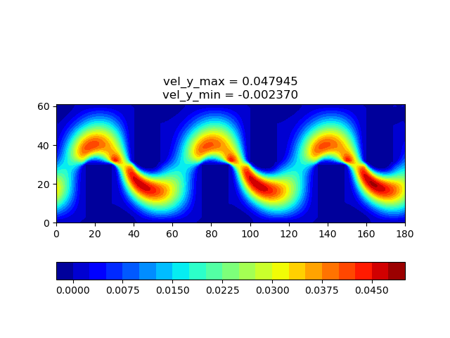

# 2D_lbm
2d Lattice Boltzmann Method for different flow cases

## 1. corrugated_tube

- flow field of velocity_Y

  

- velocity_Y at y = 64.5

  

- compared with Ansys Fluent (FVM)

  

## 2. lid_driven_cavity

- flow field of Velocity_Magnitude

  

- Streamline

  

## 3. poiseuille_flow

- flow field of Velocity_Y

  

- Compared with analytical solution

  

  
